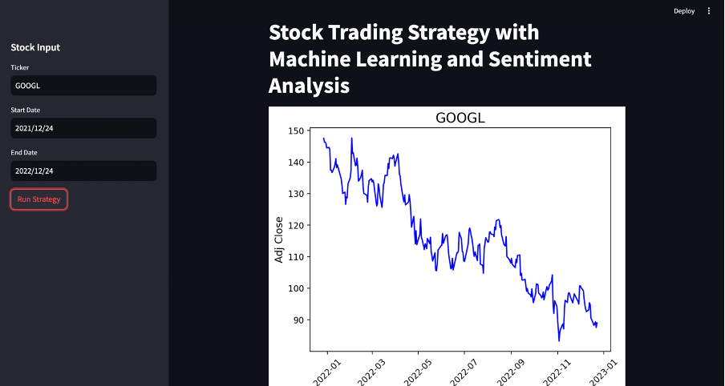
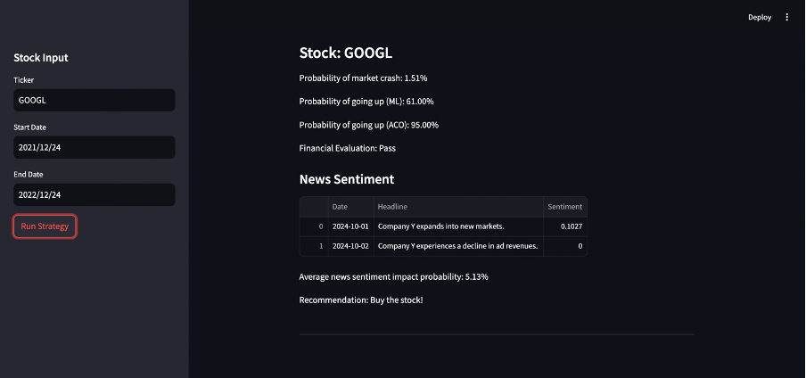

**ALGORITHMIC TRADING USING ANT COLONY OPTIMIZATION**

This project implements a trading strategy that integrates Machine Learning (ML) models, sentiment analysis, and Ant Colony Optimization (ACO) for predicting stock market trends. It aims to forecast stock price movement, analyze crash probabilities, and provide trading recommendations by evaluating various market indicators, technical features, and financial health of a company. By using a combination of Random Forest and XGBoost classifiers for market direction predictions and crash probability estimations, alongside sentiment analysis of news headlines, the system attempts to offer a balanced and data-driven trading strategy. 

**DEMO PICTURES**

**DEMO VIDEO**

[ALGORITHMIC TRADING](ML_DEMO.mp4)

